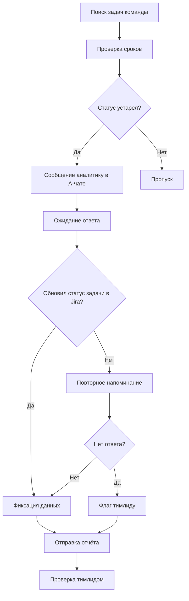

# Opportunity Solution Tree — Аналитики данных (цикл 28/26)

**Собрано:** 07.08.2026 · **Роль:** Product Discovery Lead
**Источники:** живые интервью — Вахрушева (09.07), Миниахматова (14.07), Плеханова (22.07); живой разговор с тимлидом Соколовой (23.07); `decision-log.md` (DL-5, DL-11, DL-17, DL-18, DL-19); `MVP_DevPlans_30_26.md`

> Дерево построено не вокруг одного готового решения (DL-19), а вокруг всей семьи подтверждённых гипотез трека «аналитики данных», чтобы решение по DL-19 было видно в контексте альтернатив, а не постфактум. Это соответствует принципу OST Терезы Торрес: под одной бизнес-целью — несколько возможностей, под каждой возможностью — рассмотренные варианты решений, а не единственный.

---

## Схема дерева

```
ЦЕЛЬ БИЗНЕСА
Нарастить эффективную аналитическую мощность команды без роста штата:
перенаправить рутинное время тимлидов/аналитиков в анализ и управление
командой (augment, not replace — прецедент DL-0: -30% спринта у сценаристов,
DL-1: +20% ёмкости у аналитиков)
│
├── ПРОБЛЕМА П1 · 🟡 Жёлтый (pivot)
│   Тимлид тратит ≈28–32 ч/мес на ручной сбор статусов/сроков/причин
│   переноса для еженедельного отчёта заказчику
│   │
│   └── ВОЗМОЖНОСТЬ В1
│       Тимлиду нужно, чтобы черновик отчёта собирался сам из Jira
│       и минимальных подтверждений аналитиков — а не добывался личным
│       обходом каждого человека
│       │
│       ├── РЕШЕНИЕ Р1а — «Отчёт-бот» (DL-19) ★ рекомендован к пилоту
│       │   ├── Эксперимент: pre-commit критериев 🟢/🟡/🔴 до baseline
│       │   ├── Эксперимент: baseline-замер, ≥2 «чистые» пятницы
│       │   ├── Эксперимент: пилот v0 (черновик + пробелы), 1 спринт
│       │   └── Эксперимент: пилот v1 (кнопочный пинг-цикл), 2–3 пятницы
│       │
│       ├── РЕШЕНИЕ Р1б (рассмотрено, отклонено) — полностью автономный
│       │   отчёт без проверки тимлидом
│       │   └── Отклонено: тимлид прямым текстом требует доверительной
│       │       проверки, не хочет полной автоматизации с первого раза
│       │
│       └── РЕШЕНИЕ Р1в (рассмотрено, отклонено) — пассивный дашборд
│           просроченных задач без обращения к аналитикам
│           └── Отклонено: не снимает основную боль (личный обход людей),
│               только показывает то, что тимлид и так видит в Jira
│
├── ПРОБЛЕМА П2 · 🟡 Жёлтый (pivot, ЦА уточняется)
│   Заведение задачи в Jira из брифа заказчика отнимает у аналитика
│   больше времени, чем сама задача; задачи заводятся постфактум
│   │
│   └── ВОЗМОЖНОСТЬ В2
│       Аналитику нужно, чтобы черновик задачи в Jira собирался из
│       переписки/брифа заказчика автоматически — а не копипастом вручную
│       │
│       ├── РЕШЕНИЕ Р2а — «Задача-бот» (DL-18): черновик задачи +
│       │   предложенные уточняющие вопросы к заказчику
│       │   ├── Эксперимент: интервью с рядовыми аналитиками — раздельно
│       │   │   «время на создание» vs «время на уточнение брифа»
│       │   └── Эксперимент: количественная проверка по Jira — доля задач,
│       │       заведённых >1 дня после обращения заказчика
│       │
│       └── РЕШЕНИЕ Р2б (уже существует, не работает) — Outlook-агент,
│           заводящий задачи Jira по переписке
│           └── Статус: встроен, но «работает со сбоями» (Миниахматова) —
│               чинить/расширять его или строить отдельный чат-инструмент
│               остаётся открытым вопросом реюза
│
├── ПРОБЛЕМА П3 · 🟡 Жёлтый (pivot, заблокирован данными)
│   Поиск причины просадки/роста метрики занимает от 30 минут до недели,
│   потому что инциденты и обращения никак не размечены
│   │
│   └── ВОЗМОЖНОСТЬ В3
│       Аналитику нужно, чтобы обращение автоматически сопоставлялось
│       с уже известным инцидентом — без ручного прохода по интентам
│       и похода к сценаристам за вычиткой
│       │
│       ├── РЕШЕНИЕ Р3а (узкая версия, DL-17) — zero/few-shot
│       │   классификация обращения по тексту описания инцидента
│       │   └── Эксперимент: тест на исторических инцидентах, где
│       │       инцидент и обращения уже известны постфактум
│       │
│       └── РЕШЕНИЕ Р3б (рассмотрено, отклонено) — единая размеченная
│           БД по всем инцидентам банка
│           └── Отклонено: «слишком много придётся менять в инцидент-
│               менеджменте и работе КЦ» (Плеханова) — организационно
│               неподъёмно в текущем масштабе
│
└── ПРОБЛЕМА П4 · 🟡 Жёлтый, слабее остальных (мало респондентов)
    Черновик витрины/дашборда по требованиям заказчика занимает часы;
    требования часто меняются в процессе
    │
    └── ВОЗМОЖНОСТЬ В4
        Аналитику нужен AI-черновик витрины/дашборда, который переживёт
        смену требований, а не собирается с нуля при каждой итерации
        │
        └── РЕШЕНИЕ Р4 (DL-5) — ⏸ Parked: нужно 2–4 доп. интервью,
            вопрос доли спринта остаётся открытым
```

---

## Разбор по ветвям

### Цель бизнеса

Нарастить эффективную аналитическую мощность команды **без роста штата**, перенаправив время, которое сейчас уходит на рутину (сбор статусов, заведение задач, ручной розыск причин инцидентов), в анализ и управление командой. Формулировка соответствует принципу «augment, not replace» (`CLAUDE.md`) и уже имеет прецедент на двух шипнутых продуктах: DL-0 (-30% спринта у сценаристов на RegExp), DL-1 (+20% ёмкости у аналитиков на Text→SQL).

**Метрика цели:** суммарная доля рутинного времени, возвращённая целевым ролям по пилотируемым гипотезам, без увеличения штата.

---

### П1 → В1 → Р1 (DL-19, «Отчёт-бот») — ведущая ветвь

**Проблема (кастдев):**
> «меня на это уходит на весь отдел вся пятница... основное время именно уходит на то, чтобы сбиться с каждым аналитиком и спросить, ты обновил? а вот тут ты срок поменяй, а допиши вот тут комментарий» — Плеханова, 22.07.2026

> «Проблема в том, что у нас у всех не хватает времени нормально, своевременно вести джир[у]» — Плеханова, 22.07.2026

T_до по свежему срезу гипотезы: Плеханова 32 ч/мес, Латышева 28 ч/мес → среднее 30 ч/мес. *(Цитата и транскрипт для Латышевой не входят в проверенный набор файлов — рекомендую занести её как отдельного респондента в `decision-log.md` DL-19 с источником, до этого числить n=2 как не полностью верифицированное.)* Ранее зафиксированный в decision-log сигнал n=1 (Плеханова, «вся пятница» ≈ 8 ч/нед) остаётся согласованным по порядку величины.

**Возможность:** тимлиду нужно, чтобы данные для отчёта собирались сами (Jira + подтверждение аналитика при расхождении), а не добывались личным «дожимом» каждого человека каждую пятницу.

**Решение (выбранное) — механизм бота:**
1. Находит в Jira задачи с истёкшим/приближающимся сроком и устаревшим статусом
2. Пишет ответственному аналитику в личку с просьбой обновить статус, срок, причину переноса
3. Мониторит тикет — проверяет, обновил ли аналитик данные
4. При отсутствии ответа в разумный срок — повторное напоминание
5. После обновления (в Jira или в личке) фиксирует данные для отчёта
6. Формирует черновик еженедельного отчёта по всем обработанным задачам
7. Тимлид получает черновик, проверяет и дозаполняет пробелы там, где аналитик не ответил



**Открытые вопросы (PO-заметки 07.08.2026, детали и митигации → `decision-log.md` DL-19 / `MVP_DevPlans_30_26.md` §7):**
- Реальный ли это дефицит времени, или отчасти проблема осведомлённости о штатных JQL-фильтрах/уведомлениях Jira — стоит спросить прямо, а не только проверить технически (reuse-чек Jira Automation)
- Линейная цепочка «бот спросил → аналитик ответил → отчёт готов» не покрывает: отпуск ответственного, смену owner'а в процессе, задачи без чёткого owner'а, конфликт между ответом боту и последующей правкой в Jira напрямую — добавлено в риск-таблицу MVP-плана
- Канал доставки: помимо А (bot-API)/Б (общий чат)/В (Outlook), рассмотрен email как План Г — риск низкой заметности + возможное дублирование штатных уведомлений, не входит в v0/v1
- Интерес других тимлидов — по-прежнему не проверен; нужен короткий опрос охвата
- Структурная ценность вне DL-19: привычка актуализации Jira как побочный эффект, ценна в контексте Jira как основного инструмента ведения проектов отдела — способ измерения не определён, не гейт пилота
- Масштабирование (сознательно вне MVP): настраиваемое разделение ролей «получатель отчёта» vs «источник статуса» + кастомизируемый формат отчёта под команду

**Почему не альтернативы:**
- *Полностью автономный отчёт без проверки* — отклонено: тимлид Соколова прямым текстом требует контроля — «мне нужно доверять, что он ничего не напутал в том, что есть в системе» — отсюда финальный этап проверки в самом решении.
- *Пассивный дашборд просроченных задач* — отклонено: не устраняет основную боль. Тимлид и так видит статусы в Jira; проблема — в личном обходе людей за подтверждением, а не в отсутствии видимости.

**Эксперименты (по `MVP_DevPlans_30_26.md`, MVP-1):**
- Pre-commit критериев 🟢/🟡/🔴 в DL-19 до старта baseline (не подгонять вердикт под результат)
- Baseline-замер за ≥2 «чистые» пятницы; при расхождении >2× — третья пятница
- Пилот v0: черновик отчёта с явными пробелами → тимлид сверяет построчно
- Пилот v1: кнопочный пинг-цикл аналитикам, ≥2 (до 3) боевые пятницы с полным логом
- Отдельно измеряется % и скорость ответа аналитиков на автоматический пинг — ключевой непроверенный риск

**Метрики успеха / DoD:**
- Гейт из MVP-плана (пре-коммит, приоритетный): сокращение времени подготовки отчёта **≥50% от замеренного baseline**
- Из черновика гипотезы: доля причин переноса, подтверждённых аналитиками без ручного уточнения тимлидом — **≥70%**
- Время тимлида на проверку/дозаполнение — **≤6 ч/мес** (согласуется с целевым эффектом ≈24 ч/мес, 80% сокращения — выше порога гейта)
- Повторный замер экономии времени через 3–4 недели пилота

**RICE:** R=2, I=24, C=2, E=10 дней → **Score 9,6**
**Затраты:** доступы (2 дня) + согласование входных данных (0,5) + контакты участников (0,25) + согласование ДКБ (5) + разработка скрипта (1) + тестирование (1) ≈ **10 дней**; эксплуатация ~130 запросов/мес, ~91 000 токенов/мес, 5–56 ₽/мес
**Риски:** (1) неактуальность для других тимлидов — не проверена, нужен опрос охвата; (2) готовность аналитиков отвечать боту вовремя — не проверена, закрывается финальным этапом проверки тимлидом

**Статус:** 🟡 pivot — боль и механизм решения подтверждены двумя живыми респондентами уровня ICP (Плеханова, Соколова); численный эффект ещё не подтверждён замером baseline. Самая продвинутая ветвь дерева — есть готовый dev-план (MVP-1).

---

### П2 → В2 → Р2 (DL-18, «Задача-бот»)

**Проблема (кастдев):**
> «Я тут недавно подумала о том, что много времени тратится на постановку заведения задач в джиро... я практически весь день только тем и занималась, что заводила их в джиро» — Миниахматова, 14.07.2026

> «иногда заведение описания задачи занимает у тебя больше времени, чем сама задача» — Плеханова, 22.07.2026

**Возможность:** аналитику нужно, чтобы черновик задачи в Jira формировался из брифа/переписки заказчика автоматически.

**Решение (выбранное):** черновик задачи + предложенные уточняющие вопросы к заказчику — не полная автогенерация без участия аналитика.

**Альтернатива (уже существует, не решает проблему):** встроенный в Outlook агент, заводящий задачи Jira по переписке — но «работает со сбоями» (Миниахматова). Вопрос реюза (чинить его или строить новый инструмент) остаётся открытым.

**Ключевой сигнал от ЦА:** тимлид Соколова лично задачи не заводит — это делает рядовой аналитик; тимлиду важна не скорость создания, а верное понимание брифа:
> «Мне не нужно, чтобы задачи появлялись быстрее — мне нужно, чтобы они появлялись правильно» — Соколова, 23.07.2026

**Эксперименты:** живые интервью с рядовыми аналитиками с раздельными T-вопросами (время на создание vs время на уточнение брифа у заказчика); количественная проверка по Jira — доля задач, заведённых с задержкой >1 дня от даты обращения (не требует респондентов).

**Метрики успеха:** часы/неделю по пилоту vs baseline на аналитика; явно фиксировать, если «~3 ч/нед» не подтвердится измерением — зелёный статус не выводится из одной приёмки без замера.

**Статус:** 🟡 pivot — боль реальна, но целевая аудитория и формулировка (создание vs уточнение) требуют уточнения перед пилотом. Делит Jira-инфраструктуру и ИБ-контур с DL-19 (MVP-2).

---

### П3 → В3 → Р3 (DL-17, классификация обращений по инцидентам)

**Проблема (кастдев):**
> «Почти каждый день я начинаю смотреть аварии» — Плеханова, 22.07.2026

> «А перечитывать все обращения, входящий поток на чат-бот... он огромен, это сотни тысяч сообщений, но как бы читать их все не вариант» — Плеханова, 22.07.2026

**Возможность:** аналитику нужно, чтобы обращение автоматически сопоставлялось с уже известным инцидентом — без ручного прохода по интентам и похода к сценаристам за вычиткой.

**Ключевой блокер, названный самой респонденткой:**
> «Сэкономило бы колоссальное количество времени, но есть одна проблема. На текущий момент аварии никак не размечаются. И обращения по этим авариям никак не размечаются» — Плеханова, 22.07.2026

**Решение (выбранное, суженное):** zero/few-shot классификация обращения по тексту описания инцидента — не требует существующей структурированной разметки.

**Альтернатива (рассмотрена, отклонена):** единая размеченная БД по всем инцидентам банка — отклонена как организационно неподъёмная: «мы несколько раз выходили с предложениями... но в текущих реалиях слишком много придётся менять в инцидент-менеджменте, в работе КЦ» (Плеханова).

**Эксперименты:** тест классификации на исторических инцидентах, где инцидент и связанные обращения уже известны постфактум; параллельно — интервью со сценаристами (к которым аналитик ходит за вычиткой) о их доле нагрузки.

**Метрики успеха:** не определены — требуется зафиксировать целевую точность/полноту классификации на исторической выборке до PoC.

**Статус:** 🟡 pivot, самая ранняя стадия из трёх активных ветвей — гипотезу нельзя тестировать «в лоб», сначала нужно сузить масштаб задачи под отсутствие разметки.

---

### П4 → В4 → Р4 (DL-5, AI-черновик витрины/дашборда) — второстепенная ветвь

**Проблема (кастдев, слабее подтверждена):** составление витрины/дашборда по ТЗ занимает от суток до недели (Вахрушева), но повторяемость невысокая, и Плеханова эту боль не подтвердила по своей теме.

**Возможность:** аналитику нужен AI-черновик витрины, который переживёт смену требований в процессе итераций с заказчиком — а не собирается заново при каждой правке.

**Статус:** ⏸ parked — нужно 2–4 дополнительных живых интервью в скоупе «черновик переживёт смену требований», вопрос доли спринта на витрины/BI остаётся открытым. Включена в дерево для полноты семьи гипотез, но не в приоритете следующего цикла.

---

## Рекомендация

1. **Вести пилот DL-19 первым** — самая крупная заявленная боль, два независимых живых подтверждения (аналитик + тимлид), готовый dev-план (MVP-1), общая инфраструктура с DL-18.
2. **DL-18 — параллельно, тем же контуром** (Jira-доступы, ИБ), но с обязательным дополнительным раундом интервью на рядовых аналитиках до входа в MVP-2 — иначе легко попасть не в ту ЦА, как чуть не произошло здесь.
3. **DL-17 не готова к PoC** — сначала нужно подтвердить, что zero/few-shot классификация вообще работает на исторических данных без разметки; это отдельный технический риск-эксперимент, а не пилот с людьми.
4. **DL-5 — низкий приоритет** до дополнительных интервью; не включать в текущий спринт разработки.
5. **Занести респондента «Латышева» в `decision-log.md`** отдельной записью DL-19 с цитатой/источником — иначе цифра 30 ч/мес (среднее по двум) не проходит собственный критерий проекта «запись без доказательной базы не валидна».
