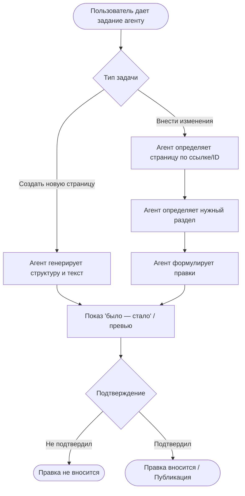

# One pager

# H-BA-10 — ИИ-агент для публикации и актуализации документов в Confluence

---

## 0. Описание

- **Owner гипотезы:** Елизавета Чукреева
- **ЦА:** все, кто опирается при работе на документацию и для кого необходимо, чтобы она поддерживалась в актуальном состоянии:
  1. новые сотрудники, для которых документация основной канал онбординга
  2. разработчики, которые опираются на документацию при разработке
  3. смежные команды, которые ходят в чужой Confluence за контекстом
  4. руководители продукта, которым важно текущее состояние продукта для принятия решений о его развитии
- **Кто пользуется агентом:** все, кто ведёт документацию в Confluence. На этапе разработки и пилота ориентируемся на Бизнес-аналитиков, которые ведут BRD, поскольку они постоянно вносят доработки в документацию. Пилот - 2-3 человека.

**Ключевые:**

- Масштабируемо: да. Механика публикации и актуализации документов не зависит от типа документа, шаблона и роли
- Критерий успеха: > 70 % всех новых правок и документов в пилотной группе создаются через агента
- Главный риск: ЦА не будет использовать инструмент - закрываем гипотезу

---

## 1. Проблема

1. Заполнение BRD - одна из самых объёмных задач бизнес-аналитика:
> «BRD - топ-3 занятие недели. BRD ≈ 3 ч при собранных требованиях; user story ≈15–30 мин с ИИ против ≈1 ч без него» — Серегина О., [интервью 28.08.2026](../Live_interview/BusinessAnalysts/Interview_BusinessAnalysts_35_26_Transcript.md)

2. Бизнес-аналитики уже закрывают её через внешние LLM. Однако возникает проблема - тексты требований по банковским продуктам могут содержать сведения, составляющие **банковскую тайну** (ст. 26 ФЗ № 395-1 «О банках и банковской деятельности»), и **персональные данные** (ФЗ № 152-ФЗ). 

Соблюдение данных нормативов зависит от качества ручного обезличивания самим аналитиком и его внимательности:

> «я стараюсь всё-таки аккуратно это делать, не так, что я там прямо просто спецификацию гружу. Нет, не гружу. То есть правила вроде соблюдаю» — Серегина О., [интервью 28.08.2026](../Live_interview/BusinessAnalysts/Interview_BusinessAnalysts_35_26_Transcript.md)

За раскрытие банковской тайны и нарушения при обработке персональных данных предусмотрена ответственность в виде административного штрафа (ст. 13.11 КоАП РФ).

3. Готовый текст переносится в Confluence руками: выгрузка, перенос, оформление таблиц и разделов
> «Генерировал часть каких-то требований, которые потом копировал и вставлял» — Трифонов А., [интервью 02.09.2026](../Live_interview/BusinessAnalysts/Interview_BusinessAnalysts_35_26_Transcript_2.md)

4. Правки/уточнения по документации приходят постоянно, но не вносятся в документ из-за длинной цепочки: «получить правки — сформулировать/сгенерировать с помощью ИИ — открыть Confluence — найти раздел — дописать» 

> «бизнес-требования постоянно уточняются. При этом их надо обновлять. И я этого не делаю. Ну, или забываю…» — Трифонов А., [интервью 02.09.2026](../Live_interview/BusinessAnalysts/Interview_BusinessAnalysts_35_26_Transcript_2.md)

5. У смежной роли - системных аналитиков - та же боль, причем при массовых изменениях возникают риски ошибок
> «мы недавно как раз тоже делали новую роль, и это нужно было поправить порядка… 800 страниц в конфлюенсе… вроде бы это такое достаточно рутинное, скучное дело, но оно занимает очень много времени у системного аналитика» — Серегина О., [интервью 28.08.2026](../Live_interview/BusinessAnalysts/Interview_BusinessAnalysts_35_26_Transcript.md)

> «системные аналитики иногда бывают факапы, и они не вносят информацию в документацию, и потом находим ошибки» — Серегина О., [интервью 28.08.2026](../Live_interview/BusinessAnalysts/Interview_BusinessAnalysts_35_26_Transcript.md)

**Цена бездействия:** 
1. Материалы заказчика уходят во внешний контур, что нарушает ст. 26 ФЗ № 395-1 «О банках и банковской деятельности», ФЗ № 152-ФЗ, а единственная защита — ручное обезличивание
2. Без автоматизации БА (и смежные роли) продолжают тратить примерно 16 рабочих часов (10% рабочего времени) на ручное обновление документации
3. Устаревшая документация порождает ошибки, которые ведут к доработкам при разработке и тестировании, задержкам релизов
---

## 2. Решение

**ИИ-агент с Web-интерфейсом**, который работает с документацией в Confluence.

**Основные сценарии:**
1. **Создание и публикация нового документа** - текст генерируется по запросу пользователя и публикуется новой страницей в Confluence
2. **Внесение правок** - агент получает от пользователя информацию, на какой странице необходимо внести изменения, генерирует изменения и публикует изменения на странице Confluence
3. **Массовое изменение** - при необходимости изменений в нескольких документах агент находит все необходимые страницы и публикует изменения

### 2.1. Сравнение вариантов архитектур

| | ИИ-агент с Web-интерфейсом | Чат-бот в корпоративном мессенджере |
| ----- | ------ | ---|
|Порог входа | - | + |
|Легкость ревью | + | - |
|Скорость разработки| - | + |
|Удобство UI| + | - |

Несмотря на преимущества чат-бота в скорости и простоте разработки, у него остается главная проблема - Проблема ревью: сверять изменения в формате «было - стало» для длинного документа внутри узкого окна чата очень неудобно, а также вести длительные диалоги с большим количеством контекста. 

### 2.2. Логика работы:

### 2.3 Контекст

**Сейчас:** 
* Бизнес-аналитики уже используют сторонние ИИ: каждые доработки/обновления приходится вносить вручную в Confluence
* Бизнес-аналитики дополнительно вручную обезличивают данные перед загрузкой во внешнюю модель
* Уточнения/изменения обсуждаются в чате, а в документацию не вносятся
* Смежная роль - системный аналитик - правит спецификации вручную, при большом изменении - сотни страниц. Часть правок теряется, ошибки находятся позже

**Будет:** 
* Правки, созданные с помощью ИИ будут сразу улетать на страницу в Confluence
* Документация будет поддерживаться в актуальном состоянии

---

## 3. Гипотеза

Бизнес-аналитик сэкономит 10% времени на переносе и публикации текста в Confluence, если ИИ-агент по запросу пользователя сгенерирует текст, найдет нужный раздел на странице, внесет правки/создаст новый документ, вместо ручного перехода и редактирования.

---

## 4. Эффекты

**Временные:**
- **T_до:** 180 мин на один BRD (примерная разбивка по времени: промптинг ≈60, вычитка и редактирование ≈100, перенос и оформление в Confluence ≈20)
- **T_после:** 160 мин - без переноса текста. Промптинг и вычитка не меняются
- **Эффект:** ≈20 мин на документ (-10%). При 2–3 BRD/мес это 0.7-1 ч/мес на человека

---

### 4.1 Ценность

* Пользователь перестает: 
  * переносить сгенерированный текст в Confluence руками
  * обезличивать данные перед внешней моделью
* Материалы заказчика не покидают внутренний контур, что снимает риск о банковской тайне и утечке персональных данных
* Документация поддерживается в актуальном состоянии, что сокращает число ошибок
* Сокращается время при доработках документации

### 4.2 Похожий опыт

**AI-агент для системных аналитиков.** Генерирует требования и публикует в Confluence (Источник: Трифонов А., [интервью 02.09.2026](../Live_interview/BusinessAnalysts/Interview_BusinessAnalysts_35_26_Transcript_2.md)) 

**Вывод для нас:** похожая функциональность есть, но системный аналитик из другой команды правит спецификации вручную, значит инструмент доступен ограниченному числу лиц.

---

## 5. Риски

|№| Риск | Тип | Решение |
|---|---|---| ---|
|1| Неверная правка в документе | Данные | Обязательный показ «было → стало» до внесения изменений, подтверждение по каждой правке |
|2| Внесение изменений не в том документе | Технический | Использование строгих идентификаторов и вывод ссылки на документ перед внесением изменений для подтверждения пользователем, а также откат страницы к прежней версии | 
|3| Конфликт версий: страницу правили параллельно | Технический | Сверка версии страницы перед записью; при расхождении правка пересобирается на актуальной версии |
|4| Рост количества ошибок при массовых правках | Данные | Массовый сценарий во вторую очередь. На старте - ограничение по числу страниц, которые можно править |
|5| ЦА не будет использовать инструмент | Поведенческий | На этапе пилота регулярный сбор обратной связи; рассмотреть вариант интеграции интерфейса в привычные каналы (например, бот в а-чат), чтобы минимизировать порог входа и максимально встроить агента в рабочие процессы |

---

## 6. Затраты на реализацию

| Этап | Что входит | Время | Кто нужен |
|---|---|---|---|
|Сбор требований и дизайн сценариев | Формализация требований к функционалу, проектирование пользовательских путей и выбор стека | 2 дня| Продуктовый аналитик и разработчик|
| Получение доступов | Получение API-ключей (Confluence, LLM) | 2 дня | ИБ-специалист, разработчик |
| Разработка прототипа | Настройка интеграции с Confluence API, подключение LLM, разработка UI | 10 дней | Разработчик |
| Тестирование работоспособности | Прогон базовых сценариев | 1 день | Разработчик |
|Пилот| Сбор пилотной группы, обучение функционалу, сбор обратной связи | 22 дня | Продуктовый аналитик и 2-3 пользователя |
|Анализ результатов пилота и принятие решения о запуске| Проведение CustDev-интервью, подсчет метрик, формирование списка доработок | 2 дня | Продуктовый аналитик |
| Вывод в полноценную эксплуатацию | Исправление замечаний с пилота, перевод на промышленные сервера | 5 дней | Разработчик |
| **Итого** | | **≈44 рабочих дня** |

Если начать с 14 сентября, то запуск пилота 5 октября и окончание 3 ноября, а завершение всех этапов - 12 ноября.

---

## 7. Шаги по разработке

1. Сбор требований и дизайн сценариев
2. Получение доступов
3. Разработка прототипа
    * Настройка интеграции с Confluence API
    * Подключение LLM
    * Настройка пользовательского интерфейса
4.  Тестирование работоспособности функционала
    * Прогон кейсов: создание документа, внесение правок в документ
    * Проверка отката, конфликта версий
5.  Пилот, 2-3 пользователя
6.  Анализ результатов пилота и принятие решения о запуске
7.  Вывод в полноценную эксплуатацию

## 8. Принятие решения о запуске

Решение о масштабировании ИИ-агента принимается по итогам пилота на основе критериев:
* Регулярность использования: > 70 % всех новых правок и документов в пилотной группе создаются через агента
* Качество ответа ИИ: > 80 % принятых от сгенерированных правок на этапе сравнения «было - стало»
* Стабильность работы: отсутствие критических ошибок интеграции, например, затирания данных, публикации сгенерированного текста не на ту страницу и тд
